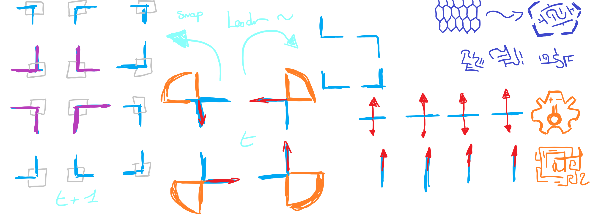

# ⚓ Anchor message:
## 🤖 Principe
L'algorithme débute avec un robot initialisé en mode "*anchor*", tandis que les robots suivants sont en mode "*boat*". L'ancrage débute avec le robot "*anchor*" envoyant des messages sur deux axes **, devant lui et à sa gauche,** sans se déplacer. Les robots "*boat*" se déplacent de manière aléatoire dans l'environnement tout en cherchant à recevoir des messages sur un axe spécifique.

L'objectif principal est que les robots "*boat*" s'ancrent sur les messages émis par le robot "*anchor*", formant ainsi une grille carrée. Les robots "*boat*" s'arrêtent lorsqu'ils reçoivent un message et envoient un message sur leur axe frontal, à condition que le message provienne de la face gauche du robot "*anchor*". Une fois cela accompli, le robot "*boat*" devient également un "*anchor*", envoie des messages sur ses axes, et le processus se répète.

Avec quatre robots, on peut former un carré de 2x2 robots, créant ainsi une boucle de messages qui permet aux groupes de robots de confirmer leur connexion. Les robots restent immobiles mais envoient des messages sur **leurs axes droit et arrière**, ce qui permet de former une grille de 4x4 robots. Ce schéma se répète jusqu'à ce que la grille atteigne la taille de l'environnement.

**En résumé**, cet algorithme utilise un robot "*anchor*" comme point de départ, établissant une communication sélective avec les robots "*boat*" pour former progressivement une grille carrée qui s'étend jusqu'à remplir tout l'environnement.

## 🛠️ Problème
L'utilisation des pogobots pose des défis significatifs pour la mise en œuvre de cet algorithme. Les robots pogobots **sont caractérisés par un mouvement bruyant et imprécis**, ce qui rend difficile la réalisation de l'algorithme décrit. **Ces robots ne sont pas capables de se déplacer de manière précise**, ce qui complique l'ancrage correct des robots dans la formation d'une grille carrée.

Un obstacle supplémentaire réside dans **l'absence d'évaluation de la distance entre les robots**. Certains robots peuvent se rapprocher excessivement des "*anchors*", tandis que d'autres peuvent rester éloignés, perturbant ainsi la formation d'un carré avec une boucle de message correcte. La précision de la direction dans l'envoi des messages n'étant pas parfaite, les robots risquent fortement de ne pas être en mesure de former un carré parfait, compromettant ainsi le succès de l'algorithme.

## 💡 Idées
**changer de robots** 🤣

## 📱 Visualisation
